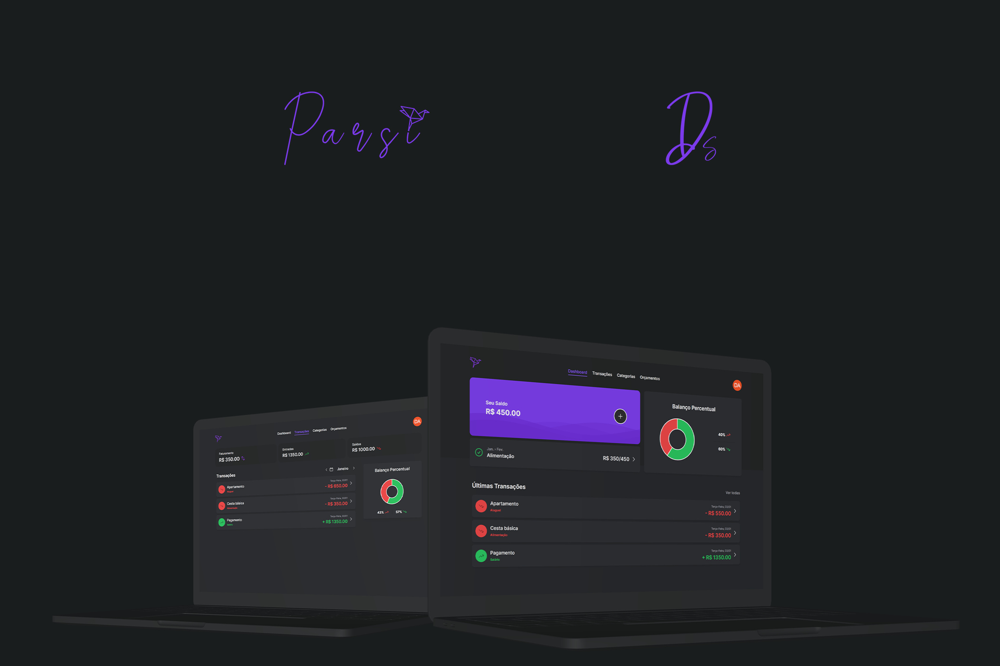
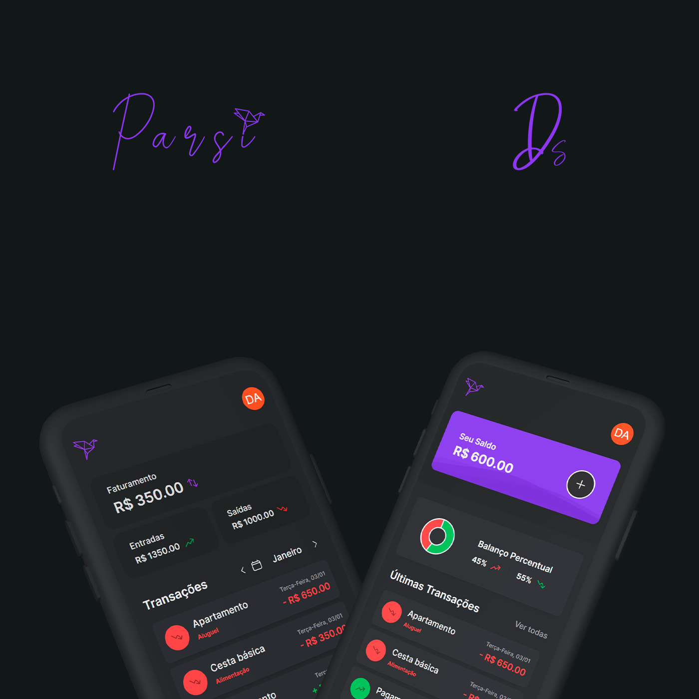

# Parsi

## :money_with_wings: **Projeto**

<h1 align="center">
    
</h1>

> _"Parsi vem de **parsimony** do inglês, que significa parcimônia. Parcimônia é o ato de economizar, poupar e conter algo ou alguma coisa"._

A Parsi é uma aplicação web que o ajuda a registrar suas transações e ter uma visão ampla sobre como estão suas entradas e saídas, auxiliando no melhor gerenciamento dos gastos. Com ela é possível criar orçamentos para limitar as despesas e salvar dinheiro, adicionar suas próprias categorias de transação. Controle total sobre o dinheiro que entra e sai do seu bolso!

<p align="center">
   <a href="https://parsi-app.vercel.app">Veja o projeto completo aqui.</a>
</p>

## :art: **Visual do Projeto**

### _Desktop e Telas Maiores_

<h1 align="center">
    
</h1>

### _Mobile e Telas Menores_

<h1 align="center">
    
</h1>

## :pushpin: **Páginas da Aplicação (Rotas)**

- Dashboard: O Dashboard é a página inicial do usuário logado, nela é apresentado um panorama geral das demais rotas, agregando informações mais recentes.

- Transações: Página que mostra as transações feitas pelo usuário, além de separa-las por mês e fazer um balanço mensal.

- Categorias: Página que contém todas as categorias do usuário e que possibilita a criação e deleção delas.

- Orçamentos: Página em que o usuário pode criar orçamentos que apresentem um limite para os gastos em determinadas despesas.

- Login/Registro: Páginas dedicadas ao login e ao cadastro das contas dos usuários.

## :wrench: **Tecnologias**

### :hammer: **Construção do site**

- [TypeScript](https://www.typescriptlang.org)
- [Vue.js](https://vuejs.org)
- [Pinia](https://pinia.vuejs.org)
- [VueUse](https://vueuse.org)
- [Chart.js](https://www.chartjs.org)
- [Node e NPM](https://nodejs.org/)
- [Vite](https://vitejs.dev/)

### :bookmark_tabs: **Banco de Dados**

- [Firebase](https://firebase.google.com/?hl=pt)
- [Firebase Authentication](https://firebase.google.com/docs/auth)
- [Firebase Firestore](https://firebase.google.com/docs/firestore)

### :art: **Estilização**

- [Tailwind CSS](https://tailwindcss.com)
- [Heroicons](https://heroicons.com)
- [Google Fonts](https://fonts.google.com)

### :open_file_folder: **IDE, Versionamento e Deploy**

- [Visual Studio Code](https://code.visualstudio.com)
- [Git](https://git-scm.com)
- [GitHub](https://github.com)
- [Vercel](https://vercel.com/)

## :rocket: **Configurações e Instalação**

Veja [documentação de configuração do Vite](https://vitejs.dev/config/).

### **Clonando o Projeto**

```sh
git clone https://github.com/davsilvam/parsi-app.git
```

### **Executando o Projeto**

```sh
npm install
```

### **Compilar e abrir o programa para desenvolvimento**

```sh
npm run dev
```

### **Compilar e reduzir para produção**

```sh
npm run build
```

## :balance_scale: **Licença**

Esse projeto está sob a [licença MIT](https://github.com/davsilvam/parsi-app/blob/main/LICENSE.md).

<p align="center">
  Feito com :purple_heart: por <a href="https://www.linkedin.com/in/davsilvam/">David Silva</a>.
</p>

---
